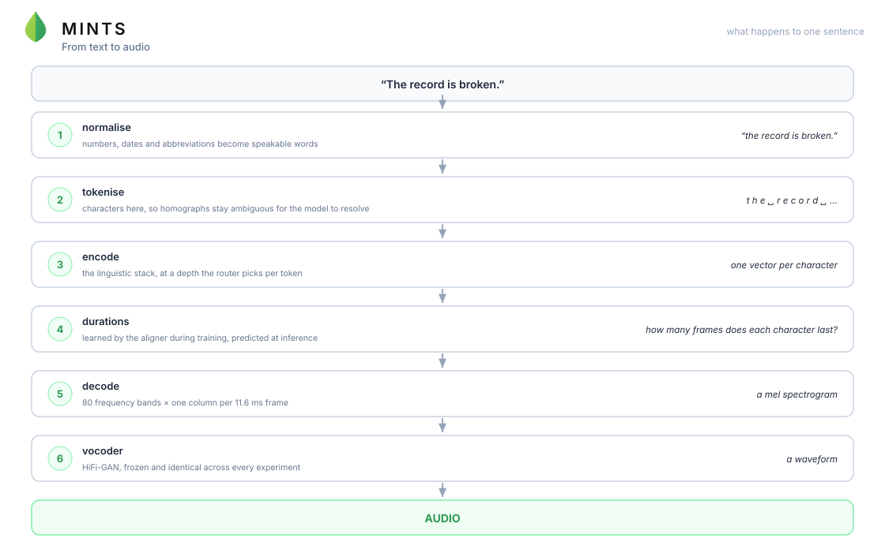
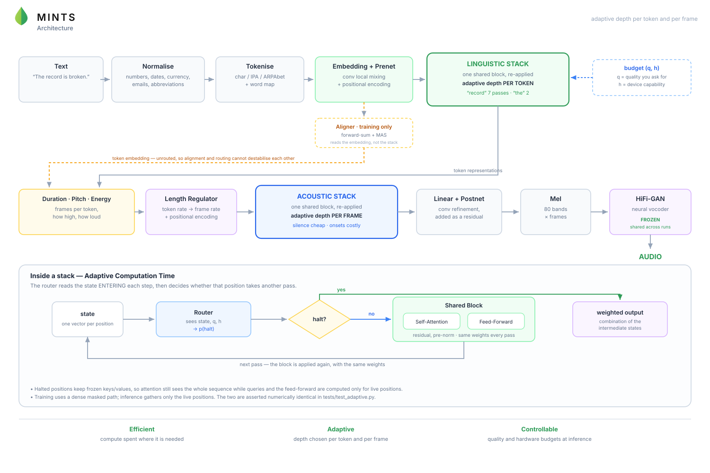

<div align="center">


### MINT-TTS — Minimal Inference Needed for Text-to-Speech

**Speech synthesis reformulated as a resource-allocation problem.**

[](https://colab.research.google.com/github/MohammedAly22/MINT-TTS/blob/main/notebooks/colab_quickstart.ipynb)
[](tests/)
[](pyproject.toml)
[](https://pytorch.org)
[](LICENSE)

[Quickstart](#quickstart) · [Architecture](#architecture) · [How it works](docs/HOW_IT_WORKS.md) · [The hypothesis](docs/HYPOTHESIS.md) · [Experiments](docs/EXPERIMENTS.md)

</div>

---

Most TTS systems spend the same computation on every token of every sentence.
That is obviously wrong.

*"Hello, how are you doing?"* is trivial — high-frequency words, one obvious
prosody, no ambiguity. *"The record is broken by the record broker."* is not:
the same spelling carries two pronunciations and only the syntax decides which.
And length is not the answer either — *"I went to the store and I bought some
milk and some bread and some eggs"* is long and completely easy.

MINT-TTS learns **how much computation each token and each acoustic frame
actually needs**, under a quality budget you choose at inference time:

$$\text{Text} \;\rightarrow\; \text{Information requirements} \;\rightarrow\; \text{Minimum compute} \;\rightarrow\; \text{Audio}$$

The learned quantity is $C^{*}(x, q, h)$: the least computation that still
reaches quality $q$ for utterance $x$ on a device with capability $h$.

> **Status: an instrument, not a result.** The pipeline is verified end to end
> and every component does what it says. The hypothesis itself is still open —
> that is the point of the repository. See [Where this stands](#where-this-stands).

---

## Resources

| | | |
|---|---|---|
| **Colab notebook** | run the full experiment on a free GPU | [](https://colab.research.google.com/github/MohammedAly22/MINT-TTS/blob/main/notebooks/colab_quickstart.ipynb) |
| **How it works** | every term explained from scratch | [docs/HOW_IT_WORKS.md](docs/HOW_IT_WORKS.md) |
| **Hypothesis** | the claim, and what would falsify it | [docs/HYPOTHESIS.md](docs/HYPOTHESIS.md) |
| **Model weights** | pretrained checkpoints | `planned` — Hugging Face |
| **Interactive demo** | type a sentence, hear it, see the heatmap | `planned` — Hugging Face Space |
| **Audio samples** | side-by-side homograph renditions | `planned` |
| **Paper** | the write-up | `planned` |
| **PyPI** | `pip install mint-tts` | `planned` |

Items marked `planned` do not exist yet and are listed so the structure is
visible — no dead links are provided for them.

---

## Quickstart

```bash
git clone https://github.com/MohammedAly22/MINT-TTS.git && cd MINT-TTS
pip install -r requirements.txt

python scripts/inspect_frontend.py    # how each text frontend handles homographs
python -m pytest -q                   # 99 tests, ~20 s
```

Train on LJSpeech:

```bash
# 1. data (2.6 GB)
curl -L -o ljs.tar.bz2 https://data.keithito.com/data/speech/LJSpeech-1.1.tar.bz2
tar -xjf ljs.tar.bz2 -C data/
python scripts/prepare_dataset.py --dataset ljspeech --root data/LJSpeech-1.1

# 2. a real vocoder, so you can judge by ear
python scripts/download_vocoder.py \
    --hf-repo speechbrain/tts-hifigan-ljspeech --hf-file generator.ckpt

# 3. features + cached tokenisation (~2-3 min, 4 workers)
python scripts/preprocess.py --config configs/experiment_char.yaml --workers 4

# 4. the experiment
python scripts/train.py --config configs/experiment_char.yaml

# 5. watch it think
tensorboard --logdir runs
```

---

## From text to audio

<div align="center"></div>

---

## Architecture

<div align="center"></div>

### What makes it adaptive

Both stacks are the same class, `AdaptiveStack`, with three routing modes:

| `routing` | Halting decision | Used by |
|---|---|---|
| `fixed` | none — every position takes every step | the dense baseline |
| `sentence` | one decision per utterance | Experiment 1 |
| `token` | one decision per token/frame (ACT) | Experiments 2–5 |

The baseline and the adaptive model are **the same code with a different flag**,
so the comparison is a controlled experiment rather than two codebases that
happen to be benchmarked together.

Halting follows Adaptive Computation Time. At each pass the router emits a
halting probability per position; the output is a weighted combination of the
intermediate states. Two numbers come out, and they are not the same:

$$\text{ponder}_t = n^{\text{updates}}_t + r_t \qquad\qquad c_t = \frac{n^{\text{updates}}_t}{N}$$

`ponder` is the differentiable objective the compute penalty acts on; $c_t$ is
the executed depth — what the FLOP counter and every heatmap report.

### Depth, not experts

The router does not ask *"which expert owns this token?"* (MoE). It asks
*"how many times must this representation be transformed before it is good
enough?"* With `share_weights: true` one block is re-applied, so extra depth
costs **no extra parameters** — depth becomes a pure inference-time knob.

Each pass is one round of information exchange across the sentence, so a token
needs enough passes for the disambiguating evidence to reach it. "the" needs
none.

### The budget is an input

The router receives $(q, h)$ through a small MLP producing a halting-logit bias
and FiLM parameters. Both heads are zero-initialised, so an untrained model
behaves like plain ACT and the conditioning is *learned*, not imposed. During
training $q \sim U[0,1]$, $h \sim U[0.3,1]$ and the compute penalty is scaled by
$(1-q)$ — one checkpoint spans the whole trade-off curve.

```python
syn("The record is broken by the record broker.", quality=0.3)   # cheap
syn("The record is broken by the record broker.", quality=0.95)  # careful
```

### Where the savings come from

Training uses a dense masked path (no speedup — the claim is about inference).
Inference gathers only the still-running positions, while halted positions keep
frozen keys/values in a cache so attention still sees the whole sequence.

`tests/test_adaptive.py` asserts the two paths are **numerically identical**
(~1e-6). If they ever drift, every inference measurement would be of a different
model than the one that was trained.

Two subtleties handled explicitly:

* **The final step forces a halt.** Otherwise a position that never crosses the
  threshold has `ponder == N` exactly — a constant, with zero gradient — and no
  compute penalty could move it.
* **Shared weights make halting free; independent weights do not.** A cached key
  is only valid if every step uses the same projection. With per-step weights,
  keys must be re-projected for all readable positions, tracked separately as
  `kv_token_steps`.

Full detail: [`docs/ARCHITECTURE.md`](docs/ARCHITECTURE.md).

---

## The text frontend, and the homograph question

Three interchangeable frontends, because **which one you use changes what the
model has to learn**:

| `text.input_type` | Backend | Homographs |
|---|---|---|
| `char` | none | untouched — the model gets the ambiguity intact |
| `ipa` | espeak-ng (`phonemizer` + `espeakng-loader`, no system install) | resolved by espeak's own, largely context-free rules |
| `arpabet` | `g2p_en` (CMUdict + POS tagger) | *attempts* contextual disambiguation |

`python scripts/inspect_frontend.py` measures this on ten minimal pairs:

```
'read'   A: I read a book yesterday.      B: I will read a book tomorrow.
     ipa [same   ]  A=r i: d           B=r i: d
 arpabet [DIFFERS]  A=R IY1 D          B=R EH1 D      <- varies, but backwards

'lead'   A: He will lead the team.        B: The pipe is made of lead.
     ipa [same   ]  A=l i: d           B=l i: d
 arpabet [same   ]  A=L EH1 D          B=L EH1 D      <- wrong for the verb
```

**Neither phonemiser is an oracle.** So the recommendation is not "use espeak"
or "use g2p_en" — it is to treat the frontend as an **experimental variable**.
`configs/frontend_{char,ipa,arpabet}.yaml` are identical except for the input
representation.

This matters more than it looks. Training on `ipa` gave a **null result** for a
specific reason: espeak had already chosen a pronunciation, so no ambiguity ever
reached the model, and one encoder step was as good as eight. `char` is the
setting in which the hypothesis is testable at all.

### Normalisation

An ordered rule pipeline over `num2words` — currency before bare numbers, dates
before ordinals, phone numbers before digit groups:

```
"Dr. Smith paid $1,250.75 on 3/15/2024."
  -> "doctor smith paid one thousand two hundred fifty dollars and seventy five
      cents on march fifteenth twenty twenty four."

"Call +1 (555) 123-4567 or email a.smith@mit.edu."
  -> "call plus one, five five five, one two three, four five six seven or
      email a dot smith at mit dot ee dee you."

"15 Oak St., Apt. 4B; take Oak Dr. north."
  -> "fifteen oak street, apartment four bee; take oak drive north."
```

`TextNormalizer(...).trace(text)` shows the output after every step when a rule
misfires.

---

## Monitoring

<div align="center"></div>

Every `log.probe_every` steps the trainer resynthesises a fixed probe set —
homographs, tongue twisters, normalisation cases, and long-but-easy controls —
and logs heatmaps, audio and these scalars:

| Panel | What it tells you |
|---|---|
| `align/entropy_ratio` | **check first**: ~1.0 means the aligner is at chance and nothing downstream is meaningful |
| `val/mcd_vs_chance` | ≥ 1.0 means the audio carries no information about *which* sentence was asked for |
| `compute/*_depth_spread` | ~0 means the router collapsed to a constant — no allocation, whatever the mean says |
| `probe/contrast` | compute on ambiguous words minus the rest. The claim, as one number |
| `probe/length_corr` | near 1.0 means the router only learned sentence length |
| `homograph/divergence_ratio` | > 1 means ambiguous words are *rendered differently* across contexts |
| `probe/*/token_complexity` | per-token compute heatmap, labelled with the real tokens |
| `train/*/alignment_hard` | aligner health; check this first when a run misbehaves |

Figures render with matplotlib straight into TensorBoard — no external binary.
Set `log.figure_backend: plotly` for interactive versions (hovering a cell reads
`token='r' word='record' depth=6.0/8`), ideal with W&B.

Details: [`docs/MONITORING.md`](docs/MONITORING.md).

---

## Datasets

| Corpus | Speakers | Hours | Prepare |
|---|---|---|---|
| LJSpeech | 1 | 24 | `--dataset ljspeech --root data/LJSpeech-1.1` |
| VCTK | 110 | 44 | `--dataset vctk --root data/VCTK-Corpus-0.92` |
| LibriTTS | 2400+ | up to 585 | `--dataset libritts --root data/LibriTTS --subsets train-clean-100` |
| LibriSpeech | 2400+ | up to 960 | `--dataset librispeech --root data/LibriSpeech` |

```bash
python scripts/prepare_dataset.py --dataset vctk --root data/VCTK-Corpus-0.92
python scripts/preprocess.py --config configs/vctk_token.yaml --workers 4
python scripts/train.py      --config configs/vctk_token.yaml
```

Multi-speaker is wired end to end: `model.n_speakers: auto` reads the real count
from the preprocessed corpus, so the config cannot silently disagree with the
data. Your own corpus works through pipe filelists, CSV (with emotion labels),
or JSONL — see [`docs/DATA_FORMAT.md`](docs/DATA_FORMAT.md). Only audio and a
transcript are required.

Before blaming the model for a homograph error, check the corpus can teach it:

```bash
python scripts/homograph_coverage.py --filelist filelists/ljspeech_train.txt
```

---

## Inference

```python
from mint_tts.inference.synthesize import Synthesizer

syn = Synthesizer.from_checkpoint("runs/experiment_char/checkpoints/best.pt")
res = syn("The record is broken by the record broker.", quality=0.9)
res.save("out.wav")

print(res.summary())
for word, c in zip(res.encoded.words, res.word_complexity):
    print(f"{word:>10s}  {c:.3f}")   # where the compute went
```

```bash
python scripts/synthesize.py --checkpoint runs/experiment_char/checkpoints/best.pt \
    --text "I read a book yesterday." --quality 0.9

# the same sentence across the whole budget: C*(x, q)
python scripts/synthesize.py --checkpoint ... --text "..." --sweep-quality
```

---

## Repository layout

```
mint_tts/
├── config.py            YAML configs with _base_ inheritance + CLI overrides
├── text/
│   ├── normalizer.py    ordered rule pipeline (num2words, dates, emails, ...)
│   ├── phonemes.py      char / espeak-ng IPA / g2p_en ARPAbet backends
│   └── tokenizer.py     tokenisation + word map + persisted symbol table
├── data/                mel/pitch/energy extraction, manifests, dataset
├── modules/
│   ├── adaptive.py      <- ACT routing, budget conditioning, gathered fast path
│   ├── transformer.py   blocks with a dense path and an active-subset path
│   ├── aligner.py       forward-sum aligner + monotonic alignment search
│   └── variance.py      duration/pitch/energy predictors, length regulator
├── models/              AdaptiveTTS, HiFi-GAN / Griffin-Lim vocoders
├── losses/              reconstruction losses + the compute-allocation objective
├── evaluation/          MCD, WER/CER, MOS, per-utterance compute curves
├── benchmarks/          latency / RTF / FLOPs / memory measurement
├── training/            trainer, complexity probe, homograph probe
└── inference/           Synthesizer API
configs/                 base.yaml + one file per experiment and dataset
scripts/                 prepare, preprocess, train, synthesize, benchmark,
                         evaluate, compute_curve, inspect_frontend,
                         homograph_coverage, download_vocoder, make_diagrams
docs/                    how it works, hypothesis, architecture, data, experiments
tests/                   99 tests, ~20 s
```

---

## Experiments

| Config | Question |
|---|---|
| **`experiment_char.yaml`** | **the live experiment**: character input, so homographs reach the model |
| `experiment_char_unified.yaml` | the same with an adaptive decoder, where 75% of the compute is |
| `exp0_dense.yaml` / `exp0_dense_shallow.yaml` | quality ceiling and cost floor |
| `exp1_sentence.yaml` | does sentence-level adaptivity pay off at all? |
| `exp2_token.yaml` | per-token allocation on phoneme input |
| `exp3_independent.yaml` | is weight sharing as good as per-step weights? |
| `exp4_acoustic.yaml` | per-frame allocation in the acoustic decoder |
| `exp5_unified.yaml` | both, with a hardware budget: full $C^{*}(x,q,h)$ |
| `frontend_{char,ipa,arpabet}.yaml` | does the frontend disambiguate, or the model? |
| `vctk_token.yaml` / `libritts_token.yaml` | does the policy transfer across speakers and scale? |

Decision rules and tuning notes: [`docs/EXPERIMENTS.md`](docs/EXPERIMENTS.md).

---

## Where this stands

**Working and verified.** Alignment converges cleanly (`entropy_ratio` 0.47 →
0.06). Audio is intelligible, with `val/mcd_vs_chance` ≈ 0.27 — well clear of
the no-information level. Inference runs at RTF 0.05–0.09 on CPU and 0.005–0.01
on a T4. Training and inference paths are numerically identical.

**Measured, and honest about it.** On phoneme input the encoder showed *no*
headroom: one step was as good as eight, for ≥80% of utterances — because
espeak had already resolved the ambiguity. On character input that changed
(`c_star_encoder_unique` 1 → 6, uncorrelated with length), which is the first
evidence that different utterances genuinely need different compute.

**Still open.** Whether the router allocates by *linguistic difficulty* rather
than by something incidental. Early character-input runs learn one pronunciation
per spelling — likely a corpus limit rather than an architectural one, which is
what `homograph_coverage.py` exists to settle.

### Honest notes

* **The vocoder is frozen and shared** by every experiment, so a quality delta
  can never come from the vocoder. Griffin-Lim is the zero-download default and
  sounds rough; fetch HiFi-GAN before judging anything by ear.
* **`mos_proxy` is not MOS.** It is a transparent function of MCD and CER.
* **FLOPs are not speed.** `scripts/benchmark.py` reports latency, RTF, peak
  memory *and* FLOPs.
* **Adaptive gains are inference-only.** Training still pays full dense cost.
* **The encoder is 12–17% of total FLOPs; the decoder is 71–78%.** Encoder-only
  routing caps the achievable saving at ~15% however well the router works.

Status and next steps: [`ROADMAP.md`](ROADMAP.md).

---

## Requirements

Python 3.9+, PyTorch 2.1+. A single mid-range GPU is enough for LJSpeech;
CPU-only works for inference and benchmarking. espeak-ng arrives through pip
(`espeakng-loader`) — no system package needed, which is what makes the IPA
frontend work on a bare Colab runtime.

## Citation

```bibtex
@software{mint_tts,
  title  = {MINT-TTS: Minimal Inference Needed for Text-to-Speech},
  author = {Aly, Mohammed},
  year   = {2026},
  url    = {https://github.com/MohammedAly22/MINT-TTS}
}
```

## License

MIT — see [LICENSE](LICENSE).
